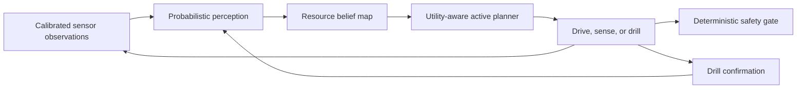

# Terra-Prospect

**A public overview of an autonomous planetary resource-prospecting software architecture.**

Terra-Prospect explores how an off-road rover could autonomously search for subsurface resources,
combine uncertain evidence from multiple sensor types, decide where additional measurements are
most valuable, and use drilling to confirm and recalibrate its map without continuous human control.

This repository is the public, non-sensitive project summary. The implementation, calibrated
parameters, datasets, model artifacts, detailed research notes, and deployment configurations are
maintained separately in a private engineering repository.

## The problem

Planetary prospecting is more than autonomous driving or selecting an interesting rock. A useful
system must answer:

- Where is a candidate resource deposit?
- How much material may be present?
- How uncertain is that estimate?
- Is the material physically reachable and worth confirming?
- Which next action buys the most useful knowledge within the mission budget?

Terra-Prospect treats this as a closed-loop **sense, update belief, plan, act, verify** problem.

## High-level approach

The architecture emphasizes:

- probabilistic resource and depth estimates rather than hard labels;
- action-conditioned information gain for active sensing;
- recoverability and energy cost in the planning objective;
- bounded learning from drill confirmation;
- deterministic safety authority over autonomous decisions;
- independent simulation truth and flight belief models for credible testing.

## System layers

| Layer | Public description |
|-------|--------------------|
| Mission | Receives campaign goals and produces resource-map products |
| Autonomy | Selects drive, sensing, and drilling actions under constraints |
| World model | Maintains terrain, resource, depth, and uncertainty beliefs |
| Perception and fusion | Converts sensor evidence into probabilistic map updates |
| Instrument interface | Standardizes calibrated, timestamped observations |
| Control and safety | Executes commands while enforcing deterministic limits |
| Platform | Provides compute, power, thermal, and hardware abstraction |

## Validation philosophy

A planner should not be tested against the same model it uses to predict observations. The project
therefore separates:

1. hidden environmental truth used by the test harness;
2. imperfect onboard observation and belief models;
3. an independent evaluator that measures map quality, discovery, efficiency, and safety.

Blind campaigns intentionally vary the hidden sensor and environment behavior from the rover's
assumptions. See [Validation Principles](docs/validation-principles.md).

## Project status

The private engineering repository contains an initial software-in-the-loop vertical slice covering
hidden truth, Bayesian belief updates, active planning, drill confirmation, bounded calibration, and
blind evaluation. This remains research and pre-flight engineering, not flight-qualified software.

## Public/private boundary

This public repository may contain:

- general architecture and design principles;
- non-sensitive diagrams and development milestones;
- high-level results that are suitable for public disclosure.

It does not contain:

- implementation source code or model weights;
- real mission, instrument, or body-specific calibration values;
- private datasets or unpublished research notes;
- detailed fault thresholds, deployment configurations, or commercial IP.

## Roadmap

See the [Public Roadmap](docs/public-roadmap.md) for the non-sensitive development sequence.

## Repository policy

This repository is published for technical portfolio and project-discovery purposes. No license is
granted for commercial use, redistribution, or creation of derivative implementations.

